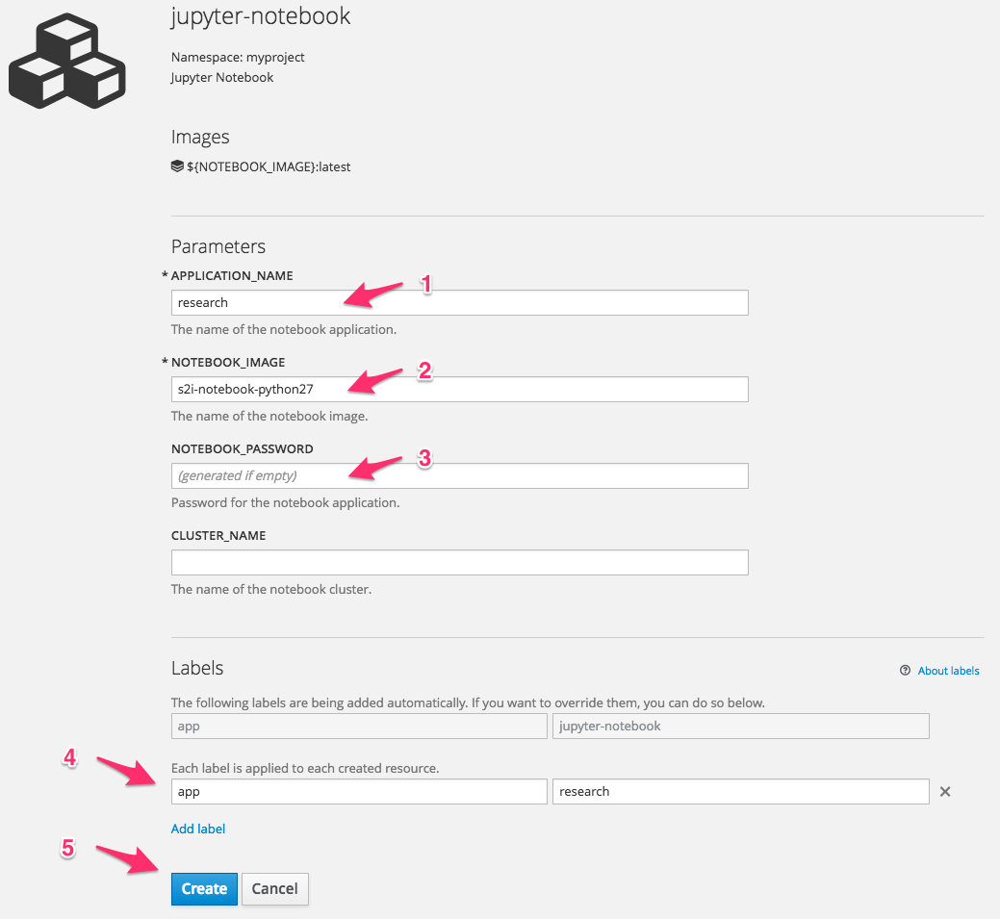
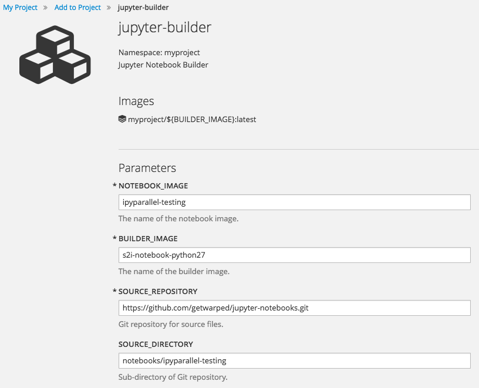

# S2I Enabled Jupyter Notebook Images

This repository provides templates and documentation for deploying [Source-to-Image](https://github.com/openshift/source-to-image) (S2I) enabled [Jupyter Notebook](http://jupyter.org) images for Python on OpenShift.

## Comparison to Jupyter Project Images

The Jupyter project provides Docker-formatted container images via their [GitHub project](https://github.com/jupyter/docker-stacks) and on [Docker Hub](https://hub.docker.com/u/jupyter/).

The images that the Jupyter project provides will not work with the default security profile of OpenShift. This is because the Jupyter project images, although they have attempted to set them up so they do not run as ``root``, will not run in a multi tenant PaaS environment where any container a user runs is forced to run with an assigned ``uid`` different to that specified by the image.

The issues preventing the Jupyter project images being able to be run in a default installation of OpenShift have been [reported](https://github.com/jupyter/docker-stacks/issues/188) via the GitHub project but at this point have not been addressed.

Trying to fix the issues in the Jupyter project images by creating a derived image that makes changes is not realistic as the nature of the changes results in the image size ballooning out to a point where it isn't practical to use. As a consequence, the Jupyter notebook images used here go back to scratch, providing a basic image and the tools to construct custom images yourself inside of OpenShift using S2I.

## Jupyter Notebook Base Image

Two Jupyter notebook base images are currently being made available:

* getwarped/s2i-notebook-python27 - ([GitHub Repository](https://github.com/getwarped/s2i-notebook-python27), [Docker Hub](https://hub.docker.com/r/getwarped/s2i-notebook-python27/))
* getwarped/s2i-notebook-python35 - ([GitHub Repository](https://github.com/getwarped/s2i-notebook-python35), [Docker Hub](https://hub.docker.com/r/getwarped/s2i-notebook-python35/))

The images include only the basic Python packages required to run a Jupyter notebook server, as well as the ``ipyparallel`` package for parallel computing.

The images are Source-to-Image (S2I) enabled, and use ``waprdrive`` to make it easy to build up custom images including additional Python packages or code, and sample notebook files and data.

## Loading Images and Templates

The easiest way to deploy the Jupyter notebook images and get working is to import which of the above images you wish to use and then use the OpenShift templates provided with this project to deploy them.

To import all the above images into your project, you can run the ``oc import-image`` command.

```
oc import-image getwarped/s2i-notebook-python27 --confirm
oc import-image getwarped/s2i-notebook-python35 --confirm
```

This should result in the creation of two image streams within your project.

```
s2i-notebook-python27
s2i-notebook-python35
```

You could deploy the images directly, but the templates provide an easier way of setting a password for your notebooks, and will also ensure that a secure HTTP connection is used when interacting with the notebook interface.

To load the OpenShift templates you can run the ``oc create`` command.


```
oc create -f https://raw.githubusercontent.com/getwarped/jupyter-notebooks/master/templates.json
```

This should create three templates within your project. The purpose of each template is as follows:

* ``jupyter-notebook`` - Deploy a notebook server from an image stream. This can be one of the standard images listed above, or a customised image which has been created using the ``jupyter-builder`` template. The notebook can optionally be linked to a parallel compute cluster created using ``jupyter-cluster``.

* ``jupyter-builder`` - Create a customised notebook image. This will run the S2I build process, starting with any of the basic images, or even a customised image, to bind additional files into the image. This can be used to incorporate pre-defined notebooks, data files, or install additional Python packages.

* ``jupyter-cluster`` - Deploy a parallel compute cluster comprising of a controller and single compute engine. The number of compute engines can be scaled up to as many as necessary.

## Deploying the Notebook Server

To deploy a notebook server, select _Add to Project_ from the web console and enter ``jupyter`` into the search filter. Select ``jupyter-notebook``.


On the page for the ``jupyter-notebook`` template fill in the name of the application, the name of the image you wish to deploy (defaults to ``s2i-notebook-python27``) and a password for the notebook server. Also override the ``app`` label applied to resources created when deploying the notebook server with a unique name. This will make it easier to delete the notebook server later.



If you do not provide your own password, a random password will be used. You can find out the name of the generated password by going to the _Environment_ tab of the _Deployments_ page for your notebook server in the OpenShift web console.

Once created the notebook server will be deployed and automatically exposed via a route to the Internet over a secure HTTP connection. You can find the URL it is exposed as from the _Overview_ page for your project.


When you visit the URL you will be prompted for the password you entered via the template to get access to the notebook server.

If you use either of the ``s2i-notebook-python27`` or ``s2i-notebook-python35`` images in the ``NOTEBOOK_IMAGE`` field of the template, you will be presented with an empty work directory. You can create new notebooks or upload your own as necessary.

Do note that by default any work you do is not being saved in a persistent volume. Thus if the notebook server is restarted at any point by you explicitly, or by OpenShift, your work will be lost.

To enable you to preserve your work, even if the notebook server is restarted, you should attach a persistent storage volume to the notebook server. This can be done from the _Deployments_ page for your notebook server.


The mount path for the storage should be set to be ``/opt/app-root/src``.


The storage should be attached before you do anything else. The notebook server will be automatically restarted when you make the storage request and attach the volume.

When done with your work, you can download your files using the Jupyter notebook interface. Alternatively, you can use the ``oc rsync`` command to copy files from your application back to your local computer.

To delete the Jupyter notebook server when no longer required, you can use the ``oc delete all --selector app=<name>`` command, where ``<name>`` is replaced with the value you gave the ``app`` label in the template page when deploying the Jupyter notebook server.

Note that when the application is deleted, the persistent storage volume will not be deleted. To delete that you should determine the name of the persistent storage volume using ``oc get pvc`` and then delete it using ``oc delete pvc/<name>``.

## Creating a Custom Image

Only a basic Jupyter notebook image is provided. If your Jupyter notebooks require additional Python packages you can create a customised image using the ``oc new-build`` command, or the ``jupyter-builder`` template.

From the web console, select ``jupyter-builder`` from the _Add to Project_ page. You will be asked to enter in the name to give the custom notebook image created, the name of the S2I builder image to use as the base, and the details of a source code repository from which files will be pulled to incorporate into the custom image. To have additional Python packages installed into the custom image, you should add a ``requirements.txt`` for ``pip`` into the directory of the source code repository that files are pulled from.



This template will only create a build and it will not appear on the _Overview_ page. You will be able to find it under the _Builds_ page. 

When the build is complete, you can then use the ``jupyter-notebook`` template to run the image, as described above, by setting ``NOTEBOOK_IMAGE`` to be the name of your custom image.

## Running a Compute Cluster

Support for running a parallel computing cluster using ``ipyparallel`` has been incorporated into all the S2I enabled images.

To set up your own compute cluster, you can use the ``jupyter-cluster`` template. Give your cluster a name and specify the notebook image to use when starting the controller and compute engines.


If you need additional Python packages, data files or Python code available in the compute engines, you can build it into a custom image to be used when starting up the cluster using the ``jupyter-builder`` template.

Once the cluster is running, you can increase the number of compute engines by increasing the replica count on the ``ipengine`` component.


To link the cluster with a Jupyter notebook server, specify the name of the cluster when deploying the notebook server using the ``jupyter-notebook`` template.


The cluster will be associated with the default profile, so the ``ipyparallel`` client can be used without needing any special arguments when it is initialised.


